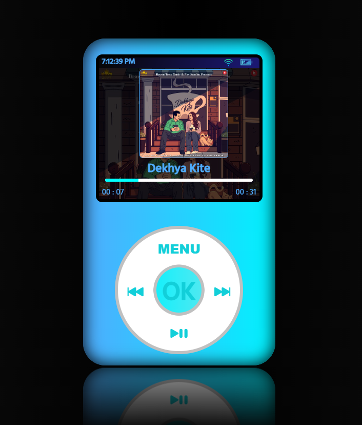

# iPod

## Overview

The iPod project is a web-based simulation of the classic iPod interface, offering functionalities like browsing menus, playing music, and controlling playback. It aims to replicate the user experience of the iconic iPod device in a modern web environment.

## Technologies Used

- **React**: The project is built using React, a popular JavaScript library for building user interfaces. React's component-based architecture makes it easy to manage the different elements of the iPod interface and handle dynamic updates efficiently.

- **ZingTouch**: ZingTouch is utilized for gesture recognition, allowing users to interact with the iPod interface using touch gestures such as rotation and tapping. This enhances the user experience by simulating the tactile feedback of the original iPod's click wheel.

- **Bootstrap Icons**: Bootstrap Icons provides a collection of scalable vector icons that are used throughout the project to enhance the visual appeal and usability of the interface.

## Features

- **Menu Navigation**: Users can navigate through various menus and options using the click wheel or touch gestures, just like on the original iPod.

- **Music Playback**: The iPod supports playing audio files, displaying song information, and controlling playback functions such as play, pause, skip forward, and skip backward.

- **Responsive Design**: The interface is designed to be responsive and adapt to different screen sizes, making it accessible across a wide range of devices, including desktops, tablets, and smartphones.

- **Real-time Clock**: A real-time clock is displayed on the interface, providing users with the current time while using the iPod application.

## Innovation

The iPod project combines the nostalgia of the classic iPod interface with modern web technologies, offering users a unique and interactive experience. By leveraging React and ZingTouch, the project replicates the functionality of the original iPod while adding enhancements such as touch gesture support and responsive design.

## Why React?

React was chosen as the primary technology for building the iPod project due to its flexibility, performance, and extensive ecosystem of libraries and tools. Its component-based architecture aligns well with the modular nature of the iPod interface, making it easy to create reusable UI components and manage state effectively.

Additionally, React's virtual DOM and efficient rendering algorithm ensure optimal performance, even when handling complex user interactions and dynamic updates. This makes it well-suited for creating interactive web applications like the iPod project.

## Available Scripts

In the project directory, you can run:

### `npm start`

Runs the app in the development mode.\
Open [http://localhost:3000](http://localhost:3000) to view it in your browser.

The page will reload when you make changes.\
You may also see any lint errors in the console.

## Screenshots

